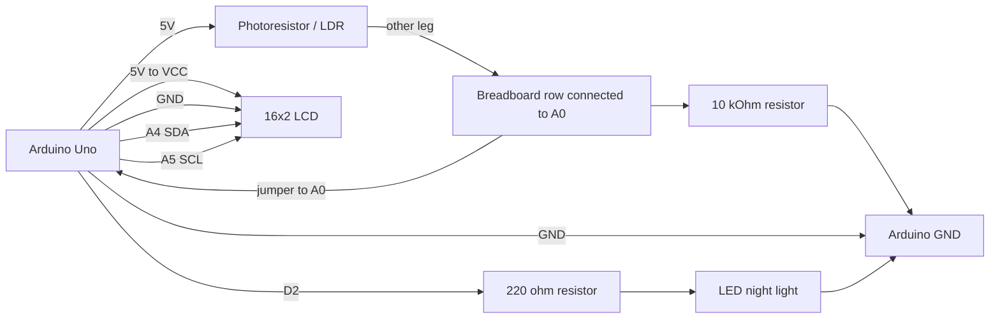
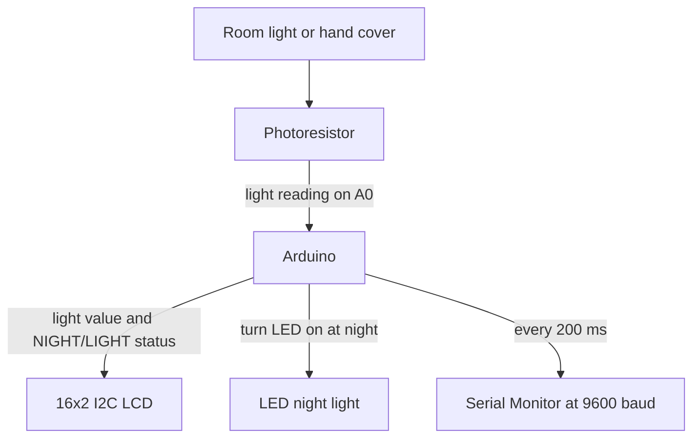

# Electronics Connections

Wiring guide for the photoresistor and LCD Automatic Night Lights and Street Lamps activity.

## Components and Connections

| Component | Pin / Terminal | Connected To | Notes |
| --- | --- | --- | --- |
| Arduino Uno | 5V | One photoresistor leg | Power |
| Arduino Uno | A0 | The shared photoresistor and 10 kOhm resistor row | Reads the light level |
| Arduino Uno | GND | One 10 kOhm resistor leg | Ground |
| Arduino Uno | A4 / SDA | LCD SDA | I2C data line |
| Arduino Uno | A5 / SCL | LCD SCL | I2C clock line |
| Arduino Uno | D2 | LED long leg through 220 ohm resistor | Turns the night light on and off |
| Photoresistor / LDR | One leg | Arduino 5V |  |
| Photoresistor / LDR | Other leg | Arduino A0 and one 10 kOhm resistor leg | All three connect on the same breadboard row |
| 10 kOhm resistor | One leg | Arduino A0 and one photoresistor leg | All three connect on the same breadboard row |
| 10 kOhm resistor | Other leg | Arduino GND |  |
| LCM1602 IIC V1 LCD | VCC | Arduino 5V | LCD power |
| LCM1602 IIC V1 LCD | GND | Arduino GND | Common ground |
| LCM1602 IIC V1 LCD | SDA | Arduino A4 / SDA | I2C data |
| LCM1602 IIC V1 LCD | SCL | Arduino A5 / SCL | I2C clock |
| LED | Long leg / anode (+) | Arduino D2 through 220 ohm resistor | Night-light output |
| LED | Short leg / cathode (-) | Arduino GND | Ground |

## Pin Assignment

| Arduino Pin | Signal | Type |
| --- | --- | --- |
| A0 | Shared row of photoresistor and 10 kOhm resistor | Light sensor reading |
| A4 / SDA | LCD SDA | I2C data |
| A5 / SCL | LCD SCL | I2C clock |
| D2 | LED long leg through 220 ohm resistor | Night-light output |
| 5V | Photoresistor divider supply | Power |
| 5V | LCD VCC | Power |
| GND | Divider resistor return, LCD GND, and LED short leg | Ground |

## Mermaid Wiring Diagram

## Signal Flow

## Notes and Assumptions

- A photoresistor and an LDR are the same type of light sensor; this activity uses the bare photoresistor from the kit rather than an LDR module.
- Connect one photoresistor leg to 5V. Connect its other leg to the same breadboard row as A0 and one leg of the 10 kOhm resistor. Connect the resistor's other leg to GND. Covering the sensor normally lowers the A0 reading.
- All values depend on the surrounding light. Record values in both bright and dark conditions before choosing a night-light threshold.
- The LCD wiring and address match Activity 2: VCC → 5V, GND → GND, SDA → A4, SCL → A5, and address `0x3F`.
- Connect the LED long leg (anode) to D2 through a 220 ohm resistor. Connect the short leg (cathode) to GND. Do not connect an LED directly to D2 without the resistor.
- The sketch uses `DARK_THRESHOLD = 400`. If the LCD does not change status at a useful light level, update this number after recording bright and dark readings.
- Install the Arduino `LiquidCrystal_I2C` library before compiling the sketch.
