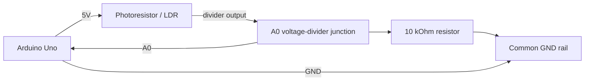
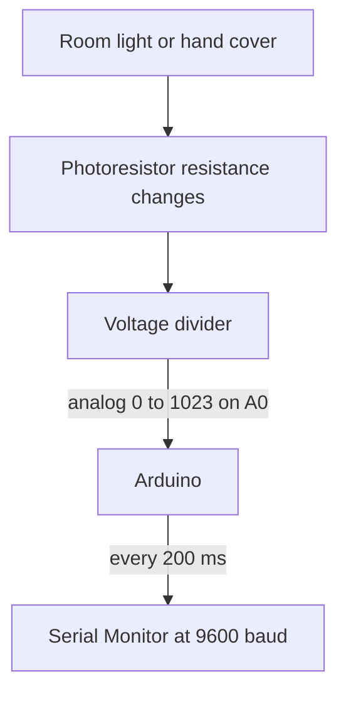

# Electronics Connections

Wiring guide for the photoresistor-based Automatic Night Lights and Street Lamps activity.

## Components and Connections

| Component | Pin / Terminal | Connected To | Notes |
| --- | --- | --- | --- |
| Arduino Uno | 5V | Photoresistor leg 1 | Voltage-divider power |
| Arduino Uno | A0 | Photoresistor/resistor junction | Analog sensor input |
| Arduino Uno | GND | 10 kOhm resistor leg 2 | Common ground |
| Photoresistor / LDR | Leg 1 | Arduino 5V | Upper part of voltage divider |
| Photoresistor / LDR | Leg 2 | A0 junction | Light-dependent divider leg |
| 10 kOhm resistor | Leg 1 | A0 junction | Lower part of voltage divider |
| 10 kOhm resistor | Leg 2 | Arduino GND | Completes voltage divider |

## Pin Assignment

| Arduino Pin | Signal | Type |
| --- | --- | --- |
| A0 | Photoresistor voltage-divider output | Analog input |
| 5V | Photoresistor divider supply | Power |
| GND | Divider resistor return | Ground |

## Mermaid Wiring Diagram

## Signal Flow

## Notes and Assumptions

- A photoresistor and an LDR are the same type of light sensor; this activity uses the bare photoresistor from the kit rather than an LDR module.
- Keep the photoresistor connected to 5V and the 10 kOhm resistor connected to GND. With this arrangement, covering the sensor normally lowers the A0 reading.
- All values depend on the surrounding light. Record values in both bright and dark conditions before choosing a night-light threshold.
