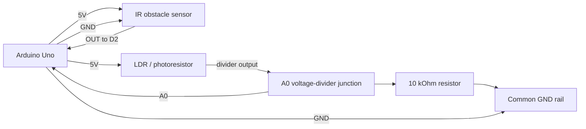
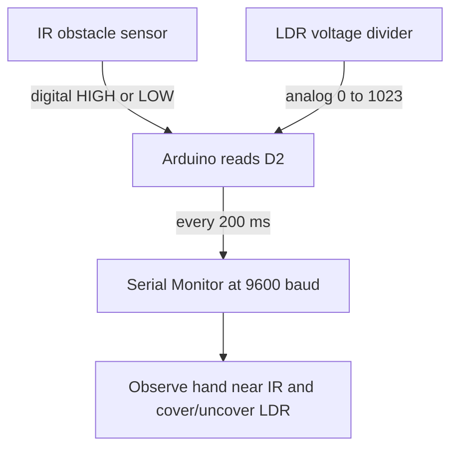

# Electronics Connections

Wiring guide for the Automatic Night Lights and Street Lamps sensor-monitoring activity.

## Components and Connections

| Component | Pin / Terminal | Connected To | Notes |
| --- | --- | --- | --- |
| Arduino Uno | 5V | IR sensor VCC and LDR top leg | Shared 5V supply |
| Arduino Uno | GND | IR sensor GND and 10 kOhm resistor bottom leg | Common ground |
| Arduino Uno | D2 | IR sensor OUT | Digital sensor input |
| Arduino Uno | A0 | LDR/resistor junction | Analog sensor input |
| IR obstacle sensor | VCC | Arduino 5V | Check module voltage label before connecting |
| IR obstacle sensor | GND | Arduino GND | Required common ground |
| IR obstacle sensor | OUT | Arduino D2 | Usually active-low when an obstacle is detected |
| LDR | Leg 1 | Arduino 5V | Upper part of voltage divider |
| LDR | Leg 2 | A0 junction | Light-dependent divider leg |
| 10 kOhm resistor | Leg 1 | A0 junction | Lower part of voltage divider |
| 10 kOhm resistor | Leg 2 | Arduino GND | Completes voltage divider |

## Pin Assignment

| Arduino Pin | Signal | Type |
| --- | --- | --- |
| D2 | IR sensor OUT | Digital input |
| A0 | LDR voltage-divider output | Analog input |
| 5V | IR VCC and LDR divider | Power |
| GND | IR GND and divider resistor | Ground |

## Mermaid Wiring Diagram

## Signal Flow

## Notes and Assumptions

- All grounds must be connected together.
- The LDR is connected to 5V and the 10 kOhm resistor is connected to GND. With this arrangement, covering the LDR normally lowers the A0 reading.
- Most common IR obstacle-sensor modules output `LOW` when an obstacle is detected. If testing shows the opposite result, reverse the `irSensorState == LOW` comparison used to set `obstacleStatus` in the sketch.
- Adjust the small onboard potentiometer on the IR module if it does not reliably detect a hand at the desired distance.
