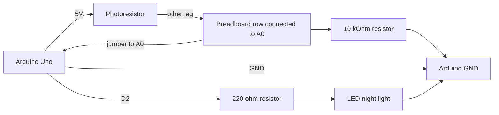
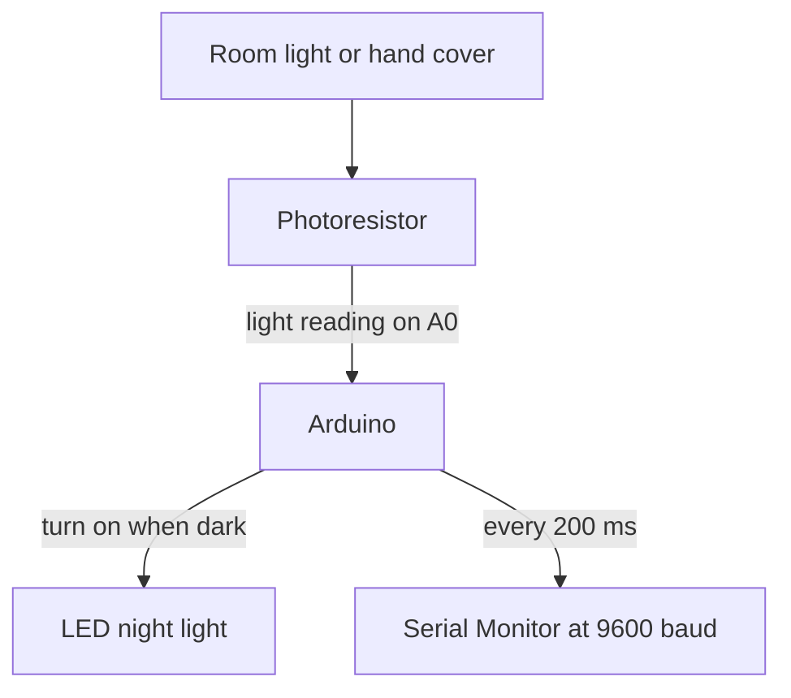

# Electronics Connections

Simple wiring guide for the Automatic Night Lights and Street Lamps activity.

## Connections

| Component | Pin / Leg | Connect To |
| --- | --- | --- |
| Photoresistor | One leg | Arduino 5V |
| Photoresistor | Other leg | Same breadboard row as Arduino A0 and one 10 kOhm resistor leg |
| 10 kOhm resistor | One leg | Same breadboard row as Arduino A0 and one photoresistor leg |
| 10 kOhm resistor | Other leg | Arduino GND |
| LED | Long leg | Arduino D2 through a 220 ohm resistor |
| LED | Short leg | Arduino GND |

## Pin Assignment

| Arduino Pin | Connect To |
| --- | --- |
| A0 | Shared photoresistor and 10 kOhm resistor row |
| D2 | LED long leg through 220 ohm resistor |
| 5V | One photoresistor leg |
| GND | 10 kOhm resistor and LED short leg |

## Mermaid Wiring Diagram

## Signal Flow

## Notes

- A photoresistor and an LDR are the same type of light sensor.
- Use the 220 ohm resistor with the LED. Do not connect the LED directly to D2.
- Covering the photoresistor normally lowers the A0 reading and turns the LED on.
- If the LED switches at the wrong brightness, change `DARK_THRESHOLD = 400` in the sketch.
